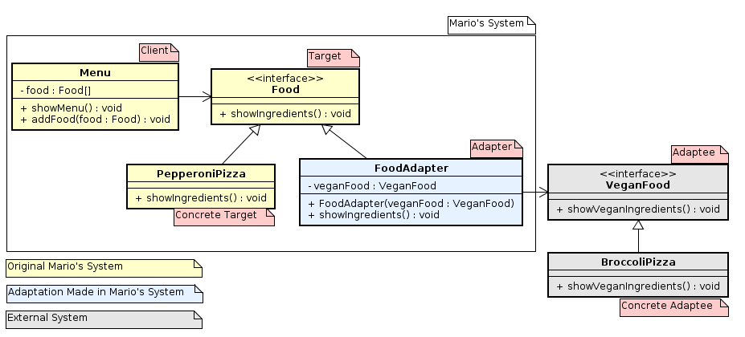

# Adapter

**_Structural Gang of Four (GoF) Pattern_**

> 

> **Description**: Allow the replacement of an object to another which has a different interface, although they have the same task.

> **Applicability**: Use the Adapter pattern when

> *	You want to use an existing class, and its interface does not match the one you need;

> *	You want to create a reusable class that cooperates with unrelated or unforeseen classes, that is, classes that don't necessarily have compatible interfaces;

> *	You need to use several existing subclasses, but it's impractical to adapt their interface by sub-classing every one. An object adapter can adapt the interface of its parent class.

---

## Example Context

> **Short Description**: An adaptation in a food menu system to show information of vegan food from another system.

> **Background History**: Mario is the owner of the **Pattern Gourmet**, a popular restaurant of his city: **Design City**. He wants to start serving Vegan Food in order to obtain new clients. Luigi, Mario's friend, knows a lot about vegan food and created a little system which shows ingredients from all kind of vegan food. Mario have his own menu system, which shows ingredients from his current non-vegan foods. Unfortunately, the Luigi's system doesn't fit well with the current Mario's system. Both want to change the Mario's system to fit the Luigi's one. Furthermore, they want to perform minimum of changes in Mario's system!

> ### Version 1.0 (Example)

> **Requirements**:

> * Show Luigi's vegan food in Mario's menu;

> * Perform only essential, minimal, changes in Mario's system.

---

## References

> https://en.wikipedia.org/wiki/Adapter_pattern

> https://github.com/iluwatar/java-design-patterns/blob/master/adapter/index.md
